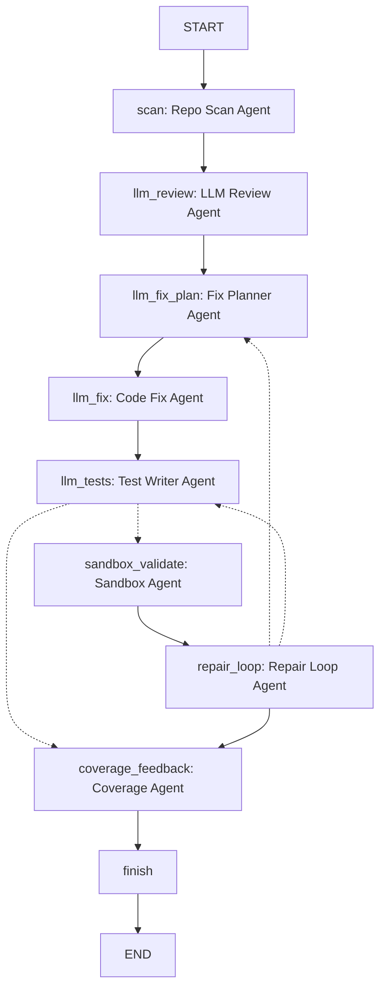
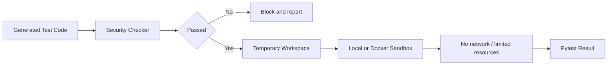

# CS599 大作业报告

| 字段 | 内容 |
| --- | --- |
| 课程名称 | 企业级应用软件设计与开发 |
| 项目名称 | Software Engineer Agent |
| 方向 | 方向一：Agentic AI 原生开发 |
| 学号 | 后续修改 |
| 姓名 | 后续修改 |
| 专业 | 后续修改 |
| 指导教师 | 戚欣 |
| 提交日期 | 2026 年 6 月 22 日 |

## 目录

1. 一、选题背景与设计思想
2. 二、Specs 规格文档
3. 三、系统架构与设计
4. 四、关键实现与代码展示
5. 五、测试与评估
6. 六、系统升级与扩展
7. 七、课程总结

## 一、选题背景与设计思想

### 1.1 问题定义

Software Engineer Agent 是一个面向 Python 项目的软件工程师 Agent 系统。它希望解决代码审查、修复建议、单元测试生成和隔离验证之间缺少自动闭环的问题。传统开发流程中，代码审查、Bug 修复、测试补齐和验证往往依赖人工串联；当项目规模变大时，审查结论难以持续跟踪，生成的测试也可能污染原项目或引入不安全行为。

本项目选择“方向一：Agentic AI 原生开发”，从零构建一个以 LangGraph 为核心的多 Agent 工作流。系统将软件工程师的工作拆分为多个节点：仓库扫描、LLM 代码审查、修复目标规划、LLM 修复、LLM 单测生成、沙箱验证、失败回跳和覆盖反馈。

### 1.2 现有方案不足

现有的简单 LLM 代码助手通常存在三类问题：

- 只生成文本建议，缺少可验证的执行闭环。
- 缺少权限隔离，生成测试或修复代码可能直接影响原项目。
- 缺少结构化报告，无法清晰追踪每个 Agent 的输入、输出、状态和失败原因。

本项目通过 LangGraph 状态图和结构化报告，将每一步 Agent 行为记录下来，并把生成测试放入 local 或 Docker sandbox 中验证。

### 1.3 项目价值

项目价值主要体现在：

- 为 Python 项目提供可观察的软件工程 Agent 工作流。
- 将 LLM 的语义能力与工程验证机制结合起来。
- 使用沙箱降低生成代码和生成测试对原项目的影响。
- 通过 JSON / Markdown 运行报告和 PDF 课程报告提供可审计结果。
- 为后续接入 SWE-bench 风格任务、真实仓库修复和更强评估指标打基础。

### 1.4 Agent 工作流技术路线

技术路线如下。这里的“目标 Python 仓库”指被审查和验证的输入项目；Agent 系统本身负责读取仓库、调用模型、生成建议和测试，并在隔离环境中验证结果。

```text
目标 Python 仓库
  -> Repo Scan Agent
  -> LLM Code Review Agent
  -> LLM Fix Planner Agent
  -> LLM Code Fix Agent（默认 dry-run，显式 apply 后写回）
  -> LLM Test Writer Agent
  -> Local / Docker Sandbox Validator Agent
  -> Repair Loop Agent
  -> Coverage Feedback Agent
  -> JSON / Markdown 运行报告
```

PDF 报告不是 Agent 主流程的直接输出，而是课程交付文档，由 `docs/CS599_大作业报告.md` 通过 `scripts/export_report_pdf.py` 导出生成。

项目使用的主要技术：

| 类别 | 技术 |
| --- | --- |
| Agent 编排 | LangGraph |
| LLM 接入 | DashScope、DeepSeek、OpenAI-compatible API、Ollama |
| 权限隔离 | Docker sandbox、临时工作区、Security Checker |
| 测试框架 | pytest、unittest |
| 可观测性 | Agent Timeline、JSON 报告、Markdown 报告、Benchmark |
| 开发工具 | Codex、Git、Docker、PowerShell |

## 二、Specs 规格文档

本项目采用 SDD 规格驱动开发思路，将需求拆分为 Product Spec、Architecture Spec 和 API Spec。为避免交付文档分散，三类规格不再拆成独立文件，而是统一写入本报告第二章，便于评审直接阅读。

### 2.1 Product Spec

Product Spec 定义系统目标、用户场景、功能需求和非功能需求。核心需求包括：

| 编号 | 需求 |
| --- | --- |
| FR-1 | 扫描 Python 仓库并识别源码、测试、配置、依赖和入口点。 |
| FR-2 | 调用真实 LLM 执行语义代码审查。 |
| FR-3 | 调用真实 LLM 生成 pytest 测试。 |
| FR-4 | 根据 LLM findings 规划修复目标和修复顺序。 |
| FR-5 | 调用真实 LLM 生成修复建议。 |
| FR-6 | 对生成测试执行安全检查。 |
| FR-7 | 在 local 或 Docker 后端运行生成测试。 |
| FR-8 | 根据沙箱结果决定回跳 LLM Fix Agent 或 LLM Test Agent。 |
| FR-9 | 输出覆盖反馈。 |
| FR-10 | 输出 JSON 和 Markdown 报告。 |
| FR-11 | API Key 只能通过环境变量读取，不得硬编码。 |

非功能需求包括 dry-run 默认行为、沙箱隔离、报告脱敏、结构化失败报告和无 API Key 时的降级运行。

### 2.2 Architecture Spec

Architecture Spec 定义分层架构：

| 层级 | 职责 |
| --- | --- |
| CLI 层 | `src.engineer` 作为唯一主入口，`src.benchmark` 作为评估入口。 |
| Workflow 层 | `src/workflow/software_engineer_graph.py` 构建 LangGraph 状态图。 |
| Agent 层 | Repo Scan、LLM Review、Fix Planner、Code Fix、Test Writer、Sandbox、Repair、Coverage。 |
| Tool 层 | 报告写出、Prompt 构建、临时工作区、LLM Client。 |
| Sandbox 层 | local executor 与 Docker executor。 |

### 2.3 API Spec

主入口：

```bash
python -m src.engineer <project_path> [options]
```

关键参数：

| 参数 | 必填 | 说明 |
| --- | --- | --- |
| `project_path` | 是 | 待审查 Python 项目路径。 |
| `--output` | 否 | JSON 报告输出路径。 |
| `--output-md` | 否 | Markdown 报告输出路径。 |
| `--apply-fixes` | 否 | 将 LLM 修复写回源码，默认 dry-run。 |
| `--apply-tests` | 否 | 将 LLM 测试写回项目，默认 dry-run。 |
| `--run-sandbox` | 否 | 启用沙箱验证。 |
| `--sandbox-executor` | 否 | `local` 或 `docker`。 |
| `--repair-iterations` | 否 | repair loop 最大重试次数，默认 3。 |
| `--no-stream` | 否 | 关闭 Agent 级别流式进度。 |
| `--no-llm-token-stream` | 否 | 关闭 LLM token 级输出。 |

## 三、系统架构与设计

### 3.1 总体架构图



项目中导出的流程图位于 `docs/runs/software_engineer_agent_flow.png`，其他流程图应以该图为准。

### 3.2 Agent 交互流程

```text
scan
  -> llm_review
  -> llm_fix_plan
  -> llm_fix
  -> llm_tests
  -> sandbox_validate? / coverage_feedback
  -> repair_loop?
      -> llm_fix_plan
      -> llm_tests
      -> coverage_feedback
  -> finish
```

关键交互说明：

- Repo Scan Agent 先扫描项目结构，产出结构化 `RepositoryScanResult`。
- LLM Review Agent 根据扫描结果和源码上下文生成审查 findings。
- Fix Planner Agent 从 findings 中选择本轮修复目标，避免一次性把所有问题交给修复 Agent。
- Code Fix Agent 根据目标 findings、修复计划和沙箱反馈生成修复建议。
- Test Writer Agent 生成 pytest 测试。
- Sandbox Agent 在临时工作区中验证生成测试。
- Repair Loop Agent 根据失败类型决定回到修复规划或测试生成。
- Coverage Agent 汇总函数覆盖情况和缺失覆盖点。

### 3.3 数据流设计

LangGraph 状态对象 `SoftwareEngineerGraphState` 保存整个工作流中的结构化数据：

| 状态字段 | 说明 |
| --- | --- |
| `project_path` | 目标项目路径。 |
| `scan` | Repo Scan Agent 输出。 |
| `llm_review` | LLM Review Agent 输出。 |
| `llm_fix_plan` | 修复目标选择结果。 |
| `llm_fix` | LLM 修复建议。 |
| `llm_tests` | LLM 生成测试。 |
| `sandbox_validation` | 沙箱执行结果。 |
| `repair_loop` | 下一步修复决策。 |
| `coverage_feedback` | 覆盖反馈。 |
| `node_trace` | Agent 执行轨迹。 |
| `status` | 最终状态。 |

### 3.4 权限隔离设计



隔离策略：

1. 默认 dry-run，不写回目标项目。
2. 只有显式传入 `--apply-fixes` 或 `--apply-tests` 才会写回。
3. 生成测试先经过 Security Checker。
4. 沙箱验证在临时工作区运行，降低对原项目的影响。
5. Docker executor 使用资源限制、网络限制和只读容器约束。

## 四、关键实现与代码展示

### 4.1 Agent 核心循环

核心文件：`src/workflow/software_engineer_graph.py`

系统通过 LangGraph `StateGraph` 注册节点和条件边。核心节点包括：

| 节点 | 作用 |
| --- | --- |
| `scan_node` | 调用 Repo Scan Agent 扫描真实项目。 |
| `llm_review_node` | 调用 LLM Review Agent 生成审查 findings。 |
| `llm_fix_plan_node` | 选择本轮修复目标和顺序。 |
| `llm_fix_node` | 调用 LLM Code Fix Agent 生成修复建议。 |
| `llm_tests_node` | 调用 LLM Test Writer Agent 生成 pytest。 |
| `sandbox_validate_node` | 在沙箱中运行测试。 |
| `repair_loop_node` | 根据沙箱结果决定下一步。 |
| `coverage_feedback_node` | 输出覆盖反馈。 |
| `finish_node` | 生成最终状态。 |

核心路由逻辑：

```text
llm_tests -> sandbox_validate 或 coverage_feedback
sandbox_validate -> repair_loop
repair_loop -> llm_fix_plan 或 llm_tests 或 coverage_feedback
```

### 4.2 Repo Scan Agent

核心文件：`src/agents/repo_scanner.py`

Repo Scan Agent 不再只是普通工具函数，而是产出结构化扫描报告：

```text
status
error_summary
source_files
test_files
config_files
dependency_files
package_roots
entry_points
issues
```

即使扫描失败，Agent 也返回 `status=failed` 和 `error_summary`，后续节点可以据此产生结构化失败报告，而不是让整个流程异常退出。

### 4.3 LLM 接入与配置

核心文件：`src/llm/config.py`、`src/llm/client.py`

系统通过 OpenAI-compatible Chat Completions 风格接口接入不同模型服务。默认 provider 为 DashScope，默认模型为 `glm-5.2`。

环境变量示例：

```bash
LLM_PROVIDER=dashscope
DASHSCOPE_API_KEY=your_key
LLM_MODEL=glm-5.2
```

DeepSeek 示例：

```bash
LLM_PROVIDER=deepseek
DEEPSEEK_API_KEY=your_key
LLM_MODEL=deepseek-v4-pro
```

报告只记录 `api_key_set` 和 `api_key_env`，不输出 API Key 明文。

### 4.4 结构化失败报告

当前每个关键节点都尽量产出结构化状态：

| Agent | 失败时行为 |
| --- | --- |
| Repo Scan Agent | 返回 `status=failed`、`error_summary` 和 issues。 |
| LLM Review Agent | 返回 `status=failed` 或 `skipped_missing_api_key`。 |
| LLM Code Fix Agent | 返回 `status=failed`、`raw_response` 摘要。 |
| LLM Test Writer Agent | 返回 `status=failed`、`error_summary`。 |
| Sandbox Agent | 返回 `status=failed`、失败类型和诊断建议。 |
| Repair Loop Agent | 返回 `blocked`、`planned` 或 `complete`。 |

### 4.5 可观测输出

运行时输出包括：

```text
[agent-stream] Repo scan: {"status":"scanned","source_files":1,...}
[agent-stream] LLM review: 3 finding(s)
[agent-stream] LLM fix planner: 2 target(s), remaining=1, planned
```

报告文件：

- `docs/runs/software_engineer.json`
- `docs/runs/software_engineer.md`
- `docs/runs/software_engineer_agent_flow.png`

### 4.6 AI IDE 使用截图

后续修改：补充 AI IDE 使用截图，包括 Agent 流程调试、代码修改、测试运行和 Git 提交过程。

## 五、测试与评估

### 5.1 功能测试

项目测试位于 `tests/`，覆盖内容包括：

| 测试文件 | 覆盖内容 |
| --- | --- |
| `test_repo_scanner_agent.py` | Repo Scan Agent 元数据扫描和结构化失败报告。 |
| `test_software_engineer_graph.py` | LangGraph 主流程、repair loop、dry-run 和写回状态。 |
| `test_priority_agents.py` | Fix Planner、Sandbox、Repair Loop 等关键 Agent。 |
| `test_llm_test_generator.py` | LLM Test Writer 的生成、写回和脱敏。 |
| `test_llm_prompt_builder.py` | Prompt 构建、LLM 配置和 API Key 优先级。 |
| `test_security_checker.py` | 生成测试安全检查。 |
| `test_sandbox_policy.py` | Docker sandbox 命令和策略。 |

验证命令：

```bash
python -m pytest tests -q
python -m compileall src tests examples
```

当前验证结果：

```text
53 passed
compileall passed
```

### 5.2 Agent 行为评估

系统通过 Agent Timeline 评估每个 Agent 是否参与工作流：

```text
01. Repo scan
02. LLM code review
03. LLM fix planner
04. LLM code fixer
05. LLM test writer
06. Sandbox pytest
07. Repair loop
08. Coverage feedback
09. Finish
```

Repo Scan Agent 已经输出结构化 stream：

```json
{
  "status": "scanned",
  "source_files": 1,
  "test_files": 0,
  "config_files": 0,
  "dependency_files": 0,
  "package_roots": 0,
  "entry_points": 0,
  "issues": [
    {"severity": "medium", "message": "No pytest-style test files were discovered."},
    {"severity": "low", "message": "No standard Python dependency file was discovered."}
  ],
  "error_summary": ""
}
```

### 5.3 Benchmark

Benchmark 入口：

```bash
python -m src.benchmark --executor local --output docs/runs/benchmark.json
```

评估指标包括：

- Benchmark case 数量
- 通过案例数
- 失败案例数
- pytest case 总数
- 计划测试数
- 生成测试数
- 执行时长

当前 smoke 运行示例：

```text
Total Cases: 1
Passed Cases: 1
Failed Cases: 0
Pass Rate: 100.00%
```

### 5.4 Demo 截图/录屏

后续修改：补充 Demo 截图或录屏，包括：

- 运行 `python -m src.engineer examples/review_target`
- 展示 `[agent-stream]` 与 `[llm-stream]`
- 展示 `docs/runs/software_engineer.md`
- 展示 `docs/runs/software_engineer_agent_flow.png`

## 六、系统升级与扩展

### 6.1 可扩展架构

当前架构已经具备扩展点：

| 扩展点 | 可扩展方向 |
| --- | --- |
| Repo Scan Agent | 支持 Java、TypeScript、多语言仓库。 |
| LLM Provider | 接入更多 OpenAI-compatible 服务或本地模型。 |
| Fix Agent | 从整文件替换升级为 unified diff patch。 |
| Sandbox | 支持更严格的只读源码挂载和网络策略。 |
| Benchmark | 接入 SWE-bench 风格任务集。 |
| Report | 增加 Web UI、Trace Viewer 或 LLMOps 面板。 |

### 6.2 下一阶段计划

下一阶段计划：

1. 增加 review-after-fix 复审节点，判断 finding 是否真的 resolved。
2. 将 LLM 修复输出从整文件 replacement 改为 unified diff。
3. 为 Docker sandbox 增加更严格的只读源码和独立写入目录。
4. 增加更真实的 benchmark 数据集。
5. 增加前端可视化界面，展示 Agent 状态图和每轮中间输出。

### 6.3 AI 能力演进路径

AI 能力演进路径：

```text
单次 LLM 调用
  -> 多 Agent 分工
  -> LangGraph 状态机
  -> 沙箱验证闭环
  -> 自动修复与回归测试
  -> 真实仓库持续工程 Agent
```

## 七、课程总结

### 7.1 个人收获

通过本项目，可以看到 Agentic AI 项目和普通 LLM 调用的差异。单次 LLM 调用只能给出建议，而工程级 Agent 系统需要状态管理、工具调用、错误处理、权限隔离和可观测报告。LangGraph 的价值在于把这些步骤组织成清晰的状态图，使每个 Agent 的职责和输出边界更明确。

### 7.2 工程思维转变

本项目体现了从“让模型回答问题”到“让 Agent 完成工程流程”的转变。为了让系统可靠运行，需要考虑：

- LLM 不可用时如何降级。
- 生成代码是否安全。
- 测试运行是否会污染原项目。
- 每个节点失败时是否有结构化输出。
- 报告是否能让评审者复现和审计。

这些问题都不是 prompt 本身能单独解决的，需要软件工程方法和 Agent 架构共同支撑。

### 7.3 对课程的建议

后续修改：补充个人对课程的具体建议。建议方向包括：增加企业真实场景案例、增加 Agent 评估指标讲解、增加 LLMOps 与安全沙箱实践、增加课堂 Demo 互评环节。

### 7.4 最终结论

Software Engineer Agent 将代码审查、修复建议、单测生成、沙箱验证和覆盖反馈整合为一个可运行、可观察、可扩展的 LangGraph 工作流。项目满足 Agentic AI 原生开发方向要求，覆盖 SDD 规格文档、工具调用、状态管理、多 Agent 协作、权限隔离、Benchmark 与报告输出等关键内容。
