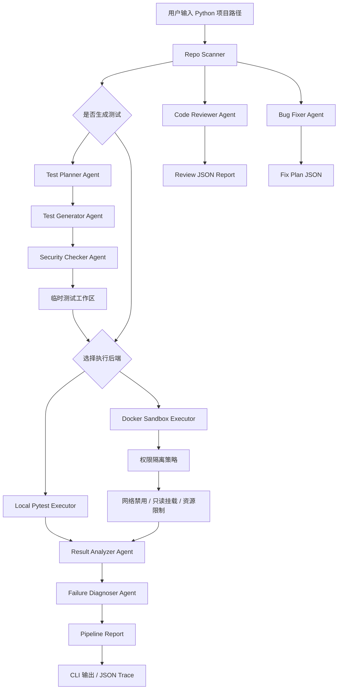

# CS599 大作业报告

## 封面

| 字段 | 内容 |
| --- | --- |
| 课程名称 | 企业级应用软件设计与开发 |
| 项目名称 | TestGuard Agent：面向 Python 项目的自动测试生成与权限隔离执行智能体 |
| 方向 | 方向一：Agentic AI 原生开发 |
| 学号 | TODO |
| 姓名 | TODO |
| 专业 | 计算机技术 / 软件工程 |
| 指导教师 | 戚欣 |
| 提交日期 | 2026 年 6 月 22 日 |

## 目录

- 一、选题背景与设计思想
- 二、Specs 规格文档
- 三、系统架构与设计
- 四、关键实现与代码展示
- 五、测试与评估
- 六、系统升级与扩展
- 七、课程总结

## 一、选题背景与设计思想

### 1.1 问题定义

软件项目需要持续测试来保障质量，但人工编写测试存在成本高、覆盖不足、回归测试维护困难等问题。LLM 可以辅助生成测试，但模型生成代码如果直接在宿主机执行，可能带来文件破坏、网络访问、资源耗尽和敏感信息泄露等风险。

TestGuard Agent 的目标是构建一个面向 Python 项目的自动测试智能体：系统能够扫描代码仓库，规划测试场景，生成 pytest 测试，在权限隔离沙箱中执行测试，执行代码审查，生成自动修 Bug 计划，并输出结构化报告、Benchmark 指标、失败诊断和后续 LLM Prompt 工件。

### 1.2 项目价值

- 降低测试编写成本：通过 Test Planner Agent 和 Test Generator Agent 自动生成基础测试。
- 提高执行安全性：通过 Docker 沙箱、只读挂载、禁用网络和资源限制降低风险。
- 增强可观测性：通过 JSON trace、Benchmark report 和诊断结果留存评估证据。
- 辅助代码审查：通过 Code Reviewer Agent 发现危险调用、疑似硬编码密钥、异常处理和测试覆盖风险。
- 支持安全修复：通过 Bug Fixer Agent 默认生成 dry-run 修复计划，避免未经确认直接改写用户源码。
- 支持后续 LLM 演进：通过 LLM Prompt Builder 将测试计划和源码上下文转化为可供模型使用的 Prompt。

### 1.3 技术路线

```text
Repo Scanner
  -> Test Planner Agent
  -> Test Generator Agent
  -> Security Checker Agent
  -> Docker Sandbox Executor
  -> Result Analyzer Agent
  -> Failure Diagnoser Agent
  -> JSON Report / Benchmark Report / LLM Prompt / Code Review Report / Fix Plan
```

本项目选择先实现可离线运行的规则型 Agent 闭环，保证 Demo 稳定；再提供 LLM Prompt 导出能力，为后续接入 DashScope、DeepSeek、OpenAI 或 Ollama 留出扩展点。

## 二、Specs 规格文档

本项目采用 SDD 规格驱动开发方法，先定义 Product Spec、Architecture Spec 和 API Spec，再逐步实现模块。

### 2.1 Product Spec

Product Spec 位于 `docs/specs/product_spec.md`，描述项目背景、用户角色、核心目标、功能需求和非功能需求。

核心功能需求包括：

- 项目扫描。
- 测试规划。
- 自动测试生成。
- 生成代码安全检查。
- Docker 权限隔离执行。
- 结果分析与失败诊断。
- Benchmark 评估。
- LLM Prompt 导出。
- 代码审查。
- 自动修 Bug。

### 2.2 Architecture Spec

Architecture Spec 位于 `docs/specs/architecture_spec.md`，定义模块职责、数据流、权限隔离设计和可观测性设计。

### 2.3 API Spec

API Spec 位于 `docs/specs/api_spec.md`，定义命令行接口、Benchmark 接口和内部数据结构。

主要命令包括：

```bash
python -m src.main examples/sample_python_project --generate-tests --executor docker --report-json docs/runs/sample_run.json
```

```bash
python -m src.benchmark --executor docker --output docs/runs/benchmark.json
```

```bash
python -m src.review examples/review_target --output docs/runs/review.json
```

```bash
python -m src.fix examples/review_target --output docs/runs/fix_plan.json
```

## 三、系统架构与设计

### 3.1 当前系统架构



### 3.2 Agent 交互流程

1. Repo Scanner 识别源码文件和测试文件。
2. Test Planner Agent 根据 AST 生成结构化测试计划。
3. Test Generator Agent 根据测试计划生成 pytest 测试。
4. Security Checker Agent 对生成测试执行 AST 安全检查。
5. Docker Sandbox Executor 在受限容器中执行 pytest。
6. Result Analyzer Agent 解析 pytest 汇总结果。
7. Failure Diagnoser Agent 输出失败类型、关键线索和修复建议。
8. Report Writer 输出 JSON trace。
9. Code Reviewer Agent 独立执行 AST 代码审查并输出 JSON 报告。
10. Bug Fixer Agent 默认生成 dry-run 修复计划，用户确认后可应用安全修复。

### 3.3 权限隔离设计

Docker 沙箱执行器采用以下策略：

- `--network none`：禁用网络。
- `--read-only`：容器根文件系统只读。
- `--mount type=bind,...,readonly`：项目源码只读挂载。
- `--tmpfs /tmp:rw,size=128m`：只开放有限临时写空间。
- `--cpus 1`、`--memory 512m`、`--pids-limit 128`：限制资源。
- `--cap-drop ALL`、`--security-opt no-new-privileges`：降低容器权限。

详见 `docs/security_policy.md`。

## 四、关键实现与代码展示

### 4.1 测试规划 Agent

代码位置：`src/agents/test_planner.py`

该模块通过 Python AST 扫描公开函数，为每个函数生成测试场景和设计理由。例如 `divide` 会生成“正常除法 + 零除边界”的测试计划。

### 4.2 测试生成 Agent

代码位置：`src/agents/test_generator.py`

该模块消费 TestPlan，生成 pytest 文件内容。当前实现是规则型生成器，后续可替换为 LLM 生成器。

### 4.3 Security Checker Agent

代码位置：`src/agents/security_checker.py`

该模块对生成测试代码执行 AST 安全检查，拦截危险 import 和高风险调用，例如 `subprocess`、`socket`、`requests`、`eval`、`exec`、`open`。

### 4.4 Docker 沙箱执行器

代码位置：`src/sandbox/docker_executor.py`

该模块构造 `docker run` 命令，执行 pytest，并捕获 stdout、stderr、退出码、耗时和超时状态。

### 4.5 结果分析与失败诊断

代码位置：

- `src/agents/result_analyzer.py`
- `src/agents/failure_diagnoser.py`

Result Analyzer 解析 pytest 汇总行，提取通过、失败、错误、跳过和警告数量。Failure Diagnoser 根据输出判断失败类型并给出修复建议。

### 4.6 LLM Prompt 导出

代码位置：

- `src/llm/prompt_builder.py`
- `src/tools/prompt_writer.py`

该模块将 TestPlan 和源码上下文转换成 LLM 测试生成 Prompt，并保证不会写出 API Key 明文。

### 4.7 Code Reviewer Agent

代码位置：

- `src/agents/code_reviewer.py`
- `src/review.py`
- `src/tools/review_writer.py`

该模块基于 Python AST 扫描源码，识别危险调用、疑似硬编码密钥、宽泛异常处理、缺失测试覆盖和除零边界风险，并导出可观测的 JSON 审查报告。

### 4.8 Bug Fixer Agent

代码位置：

- `src/agents/bug_fixer.py`
- `src/fix.py`
- `src/tools/fix_writer.py`

该模块默认生成 dry-run 修复计划，当前支持将 `eval` 替换为 `ast.literal_eval`、将疑似硬编码密钥改为 `os.getenv`、将宽泛异常收窄为 `ValueError`，并为简单除法加入显式除零保护。只有传入 `--apply` 时才会写回目标项目源码。

## 五、测试与评估

### 5.1 单元测试

当前测试位于 `tests/`，覆盖以下模块：

- Test Planner Agent。
- Test Generator Agent。
- Security Checker Agent。
- Result Analyzer Agent。
- Failure Diagnoser Agent。
- Benchmark Evaluator。
- LLM Prompt Builder。
- Code Reviewer Agent。
- Bug Fixer Agent。

验证命令：

```bash
python -m unittest discover -s tests
```

当前通过情况：26 个测试通过。

### 5.2 端到端 Demo

端到端命令：

```bash
python -m src.main examples/sample_python_project --generate-tests --executor docker --report-json docs/runs/sample_run.json
```

样例结果：

- 源码文件数：1。
- 原始测试文件数：1。
- 规划测试用例数：2。
- 生成测试用例数：2。
- Docker 中 pytest 总用例数：5。
- 结果：5 passed。
- Security Check：passed。
- Diagnosis：no_issue。

完整结果见 `docs/runs/sample_run.json`。

### 5.3 Benchmark 评估

Benchmark 命令：

```bash
python -m src.benchmark --executor docker --output docs/runs/benchmark.json
```

当前指标：

| 指标 | 数值 |
| --- | --- |
| Total Cases | 1 |
| Passed Cases | 1 |
| Failed Cases | 0 |
| Pass Rate | 100% |
| Total Pytest Cases | 5 |
| Planned Test Cases | 2 |
| Generated Test Cases | 2 |

完整结果见 `docs/runs/benchmark.json`。

### 5.4 代码审查评估

代码审查命令：

```bash
python -m src.review examples/review_target --output docs/runs/review.json
```

当前样例结果：

| 指标 | 数值 |
| --- | --- |
| Findings | 7 |
| High | 2 |
| Medium | 5 |
| Low | 0 |

完整结果见 `docs/runs/review.json`。

### 5.5 自动修 Bug 评估

修复计划命令：

```bash
python -m src.fix examples/review_target --output docs/runs/fix_plan.json
```

当前样例结果：

| 指标 | 数值 |
| --- | --- |
| Applied | False |
| Edits | 6 |
| Files Changed | 1 |

完整结果见 `docs/runs/fix_plan.json`。

## 六、系统升级与扩展

### 6.1 LLM Test Generator

当前系统已经支持导出 LLM Prompt。下一步可以接入 DashScope、DeepSeek、OpenAI 或 Ollama，将规则型 Test Generator 替换为 LLM 生成器。

### 6.2 更强的代码理解

当前 Repo Scanner 主要基于文件结构和 AST。后续可以加入 Codebase RAG，用向量检索增强跨文件依赖理解。

### 6.3 更强的安全沙箱

后续可以加入 seccomp、AppArmor、独立临时用户、只读依赖缓存和更细粒度的文件写入策略。

### 6.4 更完整的 Benchmark

当前 Benchmark 使用课程 Demo 样例。后续可以扩展为多项目、多 Bug 类型、多框架的评估集，并加入覆盖率指标。

## 七、课程总结

通过本项目，我从“直接写代码”转向“编排智能体工作流”的思路：先定义规格，再拆分 Agent 职责，再通过工具调用和沙箱执行形成工程闭环。

本项目体现了以下课程能力：

- SDD 规格驱动开发。
- Agentic workflow 编排。
- 工具调用与结构化数据流。
- Docker 权限隔离。
- 可观测性和 Benchmark 评估。
- 面向 LLM 演进的 Prompt 工程准备。

后续如果继续完善，我会优先接入真实 LLM，并扩展 Benchmark 数据集，让系统从课程 Demo 进一步走向可用的自动测试平台。
