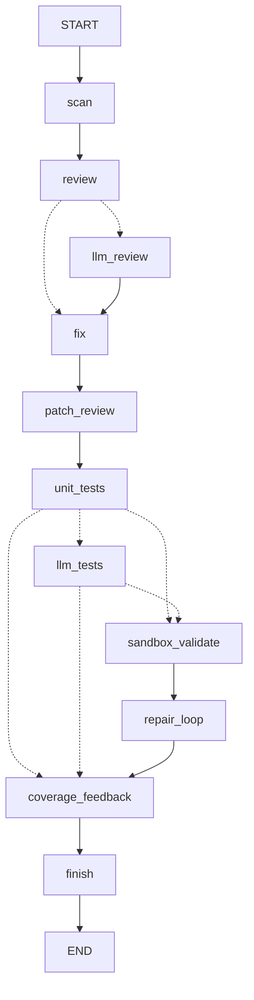

# CS599 大作业报告

## 封面

| 字段 | 内容 |
| --- | --- |
| 课程名称 | 企业级应用软件设计与开发 |
| 项目名称 | Software Engineer Agent：面向 Python 项目的软件工程师 Agent 与权限隔离执行平台 |
| 方向 | 方向一：Agentic AI 原生开发 |
| 学号 | TODO |
| 姓名 | TODO |
| 专业 | 计算机技术 / 软件工程 |
| 指导教师 | 戚欣 |
| 提交日期 | 2026 年 6 月 22 日 |

## 目录

- 一、选题背景与设计思想
- 二、Specs 规格文档
- 三、系统架构与设计
- 四、关键实现与代码展示
- 五、测试与评估
- 六、系统升级与扩展
- 七、课程总结

## 一、选题背景与设计思想

### 1.1 问题定义

软件项目需要持续代码审查、缺陷修复、单测补齐和回归验证来保障质量，但这些工作如果完全依赖人工完成，存在成本高、覆盖不足、反馈慢和风险遗漏等问题。LLM 可以辅助生成测试和修复建议，但模型生成代码如果直接在宿主机执行，可能带来文件破坏、网络访问、资源耗尽和敏感信息泄露等风险。

Software Engineer Agent 的目标是构建一个面向 Python 项目的软件工程师 Agent 与权限隔离执行平台：系统能够扫描代码仓库，执行代码审查，生成自动修 Bug 计划，补齐缺失覆盖单测，调用 LLM 生成 pytest，并在权限隔离沙箱中执行验证，最终通过统一软件工程师 Agent 输出结构化报告、Benchmark 指标、失败诊断和 LLM 生成测试工件。

### 1.2 项目价值

- 降低测试编写成本：通过 Unit Test Writer Agent、Test Planner Agent、规则 Test Generator 和 LLM Test Generator 自动生成基础测试。
- 提高执行安全性：通过 Docker 沙箱、只读挂载、禁用网络和资源限制降低风险。
- 增强可观测性：通过 JSON trace、Benchmark report 和诊断结果留存评估证据。
- 辅助代码审查：通过 Code Reviewer Agent 发现危险调用、疑似硬编码密钥、异常处理和测试覆盖风险。
- 支持安全修复：通过 Bug Fixer Agent 默认生成 dry-run 修复计划，避免未经确认直接改写用户源码。
- 补齐测试覆盖：通过 Unit Test Writer Agent 为缺失覆盖的公开函数生成 pytest 单元测试。
- 完整工程闭环：通过 Software Engineer Agent 统一编排代码审查、LLM 审查、修复计划、Patch 审查、单测生成、沙箱验证、修复循环和覆盖反馈。
- 支持 LLM 演进：通过 LLM Prompt Builder 和 OpenAI-compatible 客户端接入 DashScope / DeepSeek 等模型，并默认使用真实 Agent 调用。

### 1.3 技术路线

```text
Repo Scanner
  -> Rule Code Reviewer Agent
  -> LLM Code Reviewer Agent
  -> Bug Fixer Agent
  -> Patch Reviewer Agent
  -> Unit Test Writer Agent
  -> LLM Test Generator Agent
  -> Docker Sandbox Validator Agent
  -> Repair Loop Agent
  -> Coverage Feedback Agent
  -> JSON / Markdown Report
```

本项目采用“LangGraph 多 Agent 主流程 + 辅助测试闭环”的路线：`src.engineer` 是当前主入口，早期的 `src.main`、Benchmark 和独立 Agent CLI 保留为演示与评估辅助入口。LLM Code Reviewer 和 LLM Test Generator 通过 DashScope、DeepSeek、OpenAI-compatible 或 Ollama 接口增强生成能力，所有生成测试都必须经过安全检查和权限隔离验证。

## 二、Specs 规格文档

本项目采用 SDD 规格驱动开发方法，先定义 Product Spec、Architecture Spec 和 API Spec，再逐步实现模块。

### 2.1 Product Spec

Product Spec 位于 `docs/specs/product_spec.md`，描述项目背景、用户角色、核心目标、功能需求和非功能需求。

核心功能需求包括：

- 项目扫描。
- 测试规划。
- 自动测试生成。
- 生成代码安全检查。
- Docker 权限隔离执行。
- 结果分析与失败诊断。
- Benchmark 评估。
- LLM Prompt 导出。
- 代码审查。
- 自动修 Bug。
- 缺失覆盖单测生成。
- 软件工程师 Agent 编排。
- LLM 测试生成。

### 2.2 Architecture Spec

Architecture Spec 位于 `docs/specs/architecture_spec.md`，定义模块职责、数据流、权限隔离设计和可观测性设计。

### 2.3 API Spec

API Spec 位于 `docs/specs/api_spec.md`，定义命令行接口、Benchmark 接口和内部数据结构。

主要命令包括：

```bash
python -m src.engineer examples/review_target --use-llm-review --use-llm-tests --run-sandbox --sandbox-executor docker --output docs/runs/software_engineer.json --output-md docs/runs/software_engineer.md
```

```bash
python -m src.benchmark --executor docker --output docs/runs/benchmark.json
```

```bash
python -m src.review examples/review_target --output docs/runs/review.json
```

```bash
python -m src.fix examples/review_target --output docs/runs/fix_plan.json
```

```bash
python -m src.unit_tests examples/review_target --output docs/runs/unit_tests.json
```

```bash
python -m src.engineer examples/review_target --use-llm-review --use-llm-tests --run-sandbox --sandbox-executor docker --output docs/runs/software_engineer.json
```

```bash
python -m src.llm_tests examples/sample_python_project --output docs/runs/llm_tests.json
```

## 三、系统架构与设计

### 3.1 当前系统架构



### 3.2 Agent 交互流程

1. `scan` 识别源码文件和测试文件。
2. `review` 执行 AST 规则审查。
3. `llm_review` 在启用 `--use-llm-review` 时调用真实模型执行语义审查。
4. `fix` 默认生成 dry-run 修复计划。
5. `patch_review` 对修复计划进行二次门禁。
6. `unit_tests` 生成缺失覆盖单测，并在节点内部调用 Test Planner、规则 Test Generator 和 Security Checker。
7. `llm_tests` 在启用 `--use-llm-tests` 时调用 Prompt Builder、LLM Client 和 Security Checker 生成 pytest。
8. `sandbox_validate` 在启用 `--run-sandbox` 时将生成测试放入临时工作区，并调用本地或 Docker 沙箱执行 pytest。
9. `repair_loop` 根据 Patch 审查和沙箱结果规划下一步修复。
10. `coverage_feedback` 汇总函数覆盖比例。
11. `finish` 标记状态图完成，Report Writer 输出统一 JSON 和可观看 Markdown 报告。

### 3.3 权限隔离设计

Docker 沙箱执行器采用以下策略：

- `--network none`：禁用网络。
- `--read-only`：容器根文件系统只读。
- `--mount type=bind,...,readonly`：项目源码只读挂载。
- `--tmpfs /tmp:rw,size=128m`：只开放有限临时写空间。
- `--cpus 1`、`--memory 512m`、`--pids-limit 128`：限制资源。
- `--cap-drop ALL`、`--security-opt no-new-privileges`：降低容器权限。

详见 `docs/security_policy.md`。

## 四、关键实现与代码展示

### 4.1 测试规划 Agent

代码位置：`src/agents/test_planner.py`

该模块通过 Python AST 扫描公开函数，为每个函数生成测试场景和设计理由。例如 `divide` 会生成“正常除法 + 零除边界”的测试计划。

### 4.2 测试生成 Agent

代码位置：`src/agents/test_generator.py`

该模块消费 TestPlan，生成 pytest 文件内容。当前规则生成器作为稳定离线兜底；完整主流程同时接入 LLM Test Generator Agent。

### 4.3 Security Checker Agent

代码位置：`src/agents/security_checker.py`

该模块对生成测试代码执行 AST 安全检查，拦截危险 import 和高风险调用，例如 `subprocess`、`socket`、`requests`、`eval`、`exec`、`open`。

### 4.4 Docker 沙箱执行器

代码位置：`src/sandbox/docker_executor.py`

该模块构造 `docker run` 命令，执行 pytest，并捕获 stdout、stderr、退出码、耗时和超时状态。

### 4.5 结果分析与失败诊断

代码位置：

- `src/agents/result_analyzer.py`
- `src/agents/failure_diagnoser.py`

Result Analyzer 解析 pytest 汇总行，提取通过、失败、错误、跳过和警告数量。Failure Diagnoser 根据输出判断失败类型并给出修复建议。

### 4.6 LLM Prompt 导出

代码位置：

- `src/llm/prompt_builder.py`
- `src/tools/prompt_writer.py`

该模块将 TestPlan 和源码上下文转换成 LLM 测试生成 Prompt，并保证不会写出 API Key 明文。

### 4.7 Code Reviewer Agent

代码位置：

- `src/agents/code_reviewer.py`
- `src/review.py`
- `src/tools/review_writer.py`

该模块基于 Python AST 扫描源码，识别危险调用、疑似硬编码密钥、宽泛异常处理、缺失测试覆盖和除零边界风险，并导出可观测的 JSON 审查报告。

### 4.8 Bug Fixer Agent

代码位置：

- `src/agents/bug_fixer.py`
- `src/fix.py`
- `src/tools/fix_writer.py`

该模块默认生成 dry-run 修复计划，当前支持将 `eval` 替换为 `ast.literal_eval`、将疑似硬编码密钥改为 `os.getenv`、将宽泛异常收窄为 `ValueError`，并为简单除法加入显式除零保护。只有传入 `--apply` 时才会写回目标项目源码。

### 4.9 Unit Test Writer Agent

代码位置：

- `src/agents/unit_test_writer.py`
- `src/unit_tests.py`
- `src/tools/unit_test_writer.py`

该模块识别现有测试未覆盖的公开函数，复用 Test Planner 和 Test Generator 生成 pytest 内容，并经过 Security Checker 校验。默认 dry-run 输出 JSON 报告，只有传入 `--apply` 时才会写入目标项目测试文件。

### 4.10 Software Engineer Agent

代码位置：

- `src/engineer.py`
- `src/workflow/software_engineer_graph.py`
- `src/tools/software_engineer_graph_writer.py`

该模块使用 LangGraph StateGraph 编排 Code Reviewer、LLM Code Reviewer、Bug Fixer、Patch Reviewer、Unit Test Writer、LLM Test Generator、Sandbox Validator、Repair Loop 和 Coverage Feedback，输出包含审查发现、修复计划、Patch 审查、生成测试内容、沙箱验证结果、覆盖反馈、节点轨迹和运行状态的 JSON 报告。默认 dry-run；如需写回，可分别通过 `--apply-fixes` 和 `--apply-tests` 控制。

同时，`src/tools/software_engineer_graph_writer.py` 会输出 `docs/runs/software_engineer.md`，用于直接观看 Agent Timeline、关键发现、沙箱验证和覆盖反馈，避免只依赖 JSON 阅读。

### 4.11 LLM Test Generator Agent

代码位置：

- `src/agents/llm_test_generator.py`
- `src/llm_tests.py`
- `src/llm/client.py`
- `src/tools/llm_test_writer.py`

该模块基于 TestPlan 和源码上下文构造 Prompt，通过 OpenAI-compatible Chat Completions 接口接入 DashScope、DeepSeek、OpenAI 或本地 Ollama。生成的 pytest 内容会先经过 Security Checker，报告只记录 `api_key_set` 和 `api_key_env`，不写出 API Key 明文。课程演示默认使用环境变量中的真实 LLM 配置。

### 4.12 新增工程师 Agent 子节点

代码位置：

- `src/agents/llm_code_reviewer.py`
- `src/agents/patch_reviewer.py`
- `src/agents/sandbox_validator.py`
- `src/agents/repair_loop.py`
- `src/agents/coverage_feedback.py`

这些模块分别负责真实 LLM 语义审查、修复计划门禁、生成测试沙箱验证、下一轮修复规划和函数覆盖反馈。它们被 `src/workflow/software_engineer_graph.py` 统一编排，并通过 `node_trace` 展示 Agent 之间的状态流转。

## 五、测试与评估

### 5.1 单元测试

当前测试位于 `tests/`，覆盖以下模块：

- Test Planner Agent。
- Test Generator Agent。
- Security Checker Agent。
- Result Analyzer Agent。
- Failure Diagnoser Agent。
- Benchmark Evaluator。
- LLM Prompt Builder。
- LLM Test Generator Agent。
- Code Reviewer Agent。
- LLM Code Reviewer Agent。
- Bug Fixer Agent。
- Patch Reviewer Agent。
- Sandbox Validator Agent。
- Repair Loop Agent。
- Coverage Feedback Agent。
- Unit Test Writer Agent。
- LangGraph Software Engineer Agent。

验证命令：

```bash
python -m unittest discover -s tests
```

当前通过情况：43 个测试通过。

### 5.2 端到端 Software Engineer Agent Demo

端到端命令：

```bash
python -m src.engineer examples/review_target --use-llm-review --use-llm-tests --run-sandbox --sandbox-executor docker --output docs/runs/software_engineer.json --output-md docs/runs/software_engineer.md
```

样例结果：

- 源码文件数：1。
- 规则审查发现：7。
- LLM 审查发现：4。
- 自动修复计划：6 个编辑。
- Patch Review：passed。
- 规则单测生成：3。
- LLM 单测生成：3。
- Docker 沙箱验证：8/8 passed。
- Repair Loop：complete。
- Coverage Feedback：100%。

完整结果见 `docs/runs/software_engineer.json` 和 `docs/runs/software_engineer.md`。

### 5.3 辅助测试流水线 Demo

辅助测试闭环命令：

```bash
python -m src.main examples/sample_python_project --generate-tests --executor docker --report-json docs/runs/sample_run.json
```

该入口用于展示规则测试生成、Security Checker、Docker 沙箱执行、Result Analyzer 和 Failure Diagnoser 的可复现闭环。完整结果见 `docs/runs/sample_run.json`。

### 5.4 Benchmark 评估

Benchmark 命令：

```bash
python -m src.benchmark --executor docker --output docs/runs/benchmark.json
```

当前指标：

| 指标 | 数值 |
| --- | --- |
| Total Cases | 1 |
| Passed Cases | 1 |
| Failed Cases | 0 |
| Pass Rate | 100% |
| Total Pytest Cases | 5 |
| Planned Test Cases | 2 |
| Generated Test Cases | 2 |

完整结果见 `docs/runs/benchmark.json`。

### 5.5 代码审查评估

代码审查命令：

```bash
python -m src.review examples/review_target --output docs/runs/review.json
```

当前样例结果：

| 指标 | 数值 |
| --- | --- |
| Findings | 7 |
| High | 2 |
| Medium | 5 |
| Low | 0 |

完整结果见 `docs/runs/review.json`。

### 5.6 自动修 Bug 评估

修复计划命令：

```bash
python -m src.fix examples/review_target --output docs/runs/fix_plan.json
```

当前样例结果：

| 指标 | 数值 |
| --- | --- |
| Applied | False |
| Edits | 6 |
| Files Changed | 1 |

完整结果见 `docs/runs/fix_plan.json`。

### 5.7 缺失覆盖单测生成评估

单测生成命令：

```bash
python -m src.unit_tests examples/review_target --output docs/runs/unit_tests.json
```

当前样例结果：

| 指标 | 数值 |
| --- | --- |
| Applied | False |
| Planned Test Cases | 3 |
| Generated Test Cases | 3 |
| Security Check | passed |

完整结果见 `docs/runs/unit_tests.json`。

### 5.8 软件工程师 Agent 评估

统一运行命令：

```bash
python -m src.engineer examples/review_target --use-llm-review --use-llm-tests --run-sandbox --sandbox-executor docker --output docs/runs/software_engineer.json --output-md docs/runs/software_engineer.md
```

当前样例结果：

| 指标 | 数值 |
| --- | --- |
| Status | completed |
| Runtime | langgraph / fallback |
| Node Trace | scan -> review -> llm_review -> fix -> patch_review -> unit_tests -> llm_tests -> sandbox_validate -> repair_loop -> coverage_feedback -> finish |
| Review Findings | 7 |
| LLM Review Findings | 4 |
| Fix Edits | 6 |
| Patch Review | passed |
| Generated Unit Tests | 3 |
| Generated LLM Tests | 3 |
| Sandbox Validation | passed |
| Coverage Feedback | 100% |

完整结果见 `docs/runs/software_engineer.json`。

### 5.9 LLM 测试生成评估

LLM 测试生成命令：

```bash
python -m src.llm_tests examples/sample_python_project --output docs/runs/llm_tests.json
```

当前样例结果：

| 指标 | 数值 |
| --- | --- |
| Status | generated |
| Provider | dashscope |
| Model | glm-5.2 |
| Generated Test Cases | 2 |
| Security Check | passed |

完整结果见 `docs/runs/llm_tests.json`。

## 六、系统升级与扩展

### 6.1 更强的 LLM Test Generator

当前系统已经支持 DashScope、DeepSeek、OpenAI-compatible 和本地 Ollama 风格的 LLM 测试生成入口，并在主流程中加入修复循环规划与覆盖反馈。后续可以继续加入模型输出自检、失败用例反向 Prompt 和跨文件上下文检索，让 LLM 生成结果进一步接近真实工程使用。

### 6.2 更强的代码理解

当前 Repo Scanner 主要基于文件结构和 AST。后续可以加入 Codebase RAG，用向量检索增强跨文件依赖理解。

### 6.3 更强的安全沙箱

后续可以加入 seccomp、AppArmor、独立临时用户、只读依赖缓存和更细粒度的文件写入策略。

### 6.4 更完整的 Benchmark

当前 Benchmark 使用课程 Demo 样例，主流程已经提供函数级覆盖反馈。后续可以扩展为多项目、多 Bug 类型、多框架的评估集，并引入真实 coverage.py 行覆盖率指标。

## 七、课程总结

通过本项目，我从“直接写代码”转向“编排智能体工作流”的思路：先定义规格，再拆分 Agent 职责，再通过工具调用和沙箱执行形成工程闭环。

本项目体现了以下课程能力：

- SDD 规格驱动开发。
- Agentic workflow 编排。
- 工具调用与结构化数据流。
- Docker 权限隔离。
- 可观测性和 Benchmark 评估。
- 面向 LLM 演进的 Prompt 构建与 OpenAI-compatible 调用。

后续如果继续完善，我会优先扩展 Benchmark 数据集、真实覆盖率采集和跨文件代码理解，让系统从课程 Demo 进一步走向可用的软件工程师 Agent 平台。
