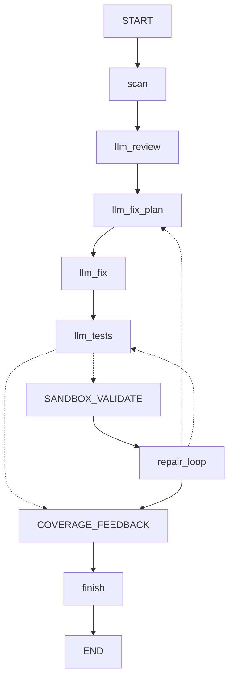

# CS599 大作业报告

## 1. 项目概述

项目名称：Software Engineer Agent

项目方向：Agentic AI 原生开发

Software Engineer Agent 是一个面向 Python 项目的软件工程师 Agent 与权限隔离执行平台。系统使用 LangGraph 编排多个 Agent，完成仓库扫描、真实 LLM 代码审查、真实 LLM 修复建议、真实 LLM 测试生成、沙箱验证、失败后回跳重试的修复循环和覆盖反馈，并输出可审计的 JSON / Markdown 报告。

当前版本已移除基于人工规则的 Bug Fix Agent、Patch Review Agent、规则 Review 节点和模板 Unit Test 节点。主流程默认直接使用 LLM Review Agent、LLM Fix Agent 与 LLM Test Agent。

## 2. 课程要求对应

| 课程要求 | 项目实现 |
| --- | --- |
| SDD 规格驱动开发 | `docs/specs/product_spec.md`、`architecture_spec.md`、`api_spec.md` |
| 工具调用 | Repo Scanner、Security Checker、Sandbox Executor、Report Writer、LLM Client |
| 状态管理 | LangGraph `StateGraph` |
| 多 Agent 协作 | LLM Review、LLM Fix Planner、LLM Fix、LLM Test、Sandbox、Repair、Coverage |
| 可观测性 | JSON 报告、Markdown 报告、Benchmark、Agent Timeline |
| 权限隔离 | Docker sandbox、临时工作区、生成代码安全检查、环境变量密钥管理 |

## 3. 总体架构



主流程：

```text
scan -> llm_review -> llm_fix_plan -> llm_fix -> llm_tests -> sandbox_validate? -> repair_loop? -> (llm_fix_plan|llm_tests)* -> coverage_feedback -> finish
```

## 4. 核心模块

### 4.1 LangGraph 主流程

位置：`src/workflow/software_engineer_graph.py`

主要节点：

- `scan_node`: 扫描 Python 项目。
- `llm_review_node`: 调用真实 LLM 做语义审查。
- `llm_fix_plan_node`: 从 LLM findings 和沙箱反馈中选择本轮一个或多个修复目标，并给出修复顺序。
- `llm_fix_node`: 调用真实 LLM 生成源码修复建议，必要时接收沙箱失败结果。
- `llm_tests_node`: 调用真实 LLM 生成 pytest。
- `sandbox_validate_node`: 在 local 或 Docker 后端执行测试。
- `repair_loop_node`: 根据沙箱结果决定回跳 `llm_fix_plan`、回跳 `llm_tests`，或结束循环。
- `coverage_feedback_node`: 汇总覆盖反馈。
- `finish_node`: 标记流程完成。

### 4.2 LLM 接入

位置：`src/llm/`

系统通过 OpenAI-compatible Chat Completions 风格接口接入 DashScope、DeepSeek、OpenAI-compatible API 和 Ollama 风格本地服务。默认 provider 为 DashScope，默认模型为 `glm-5.2`。API Key 通过 `os.getenv()` 读取，报告只记录 `api_key_set` 与 `api_key_env`。

### 4.3 权限隔离

位置：`src/sandbox/`

权限隔离由三部分组成：

1. 生成测试代码先经过 Security Checker。
2. 默认 dry-run，不写回目标项目；写回测试必须显式传入 `--apply-tests`。
3. 测试执行可以进入 Docker sandbox，使用临时工作区降低对原项目的影响。

### 4.4 报告输出

位置：`src/tools/software_engineer_graph_writer.py`

输出：

- `docs/runs/software_engineer.json`
- `docs/runs/software_engineer.md`
- Agent Timeline
- 各 Agent 的结构化结果

## 5. 运行方式

构建沙箱镜像：

```bash
docker build -f Dockerfile.sandbox -t software-engineer-agent-python .
```

运行主 Agent：

```bash
python -m src.engineer examples/review_target --run-sandbox --sandbox-executor docker --docker-image software-engineer-agent-python:latest --output docs/runs/software_engineer.json --output-md docs/runs/software_engineer.md
```

运行测试：

```bash
python -m unittest discover -s tests
python -m compileall src tests examples
```

## 6. 当前结果

完整运行时预期输出包括：

- LLM Review Findings
- LLM Fixes
- Generated LLM Tests
- Sandbox Validation
- Coverage Feedback
- Repair Loop Next Action

当沙箱测试通过时，repair loop 会输出无需继续迭代；当测试失败且未达到 `--repair-iterations` 上限时，repair loop 会先判断失败类型：像代码缺陷的问题返回给 `llm_fix_plan` 重新选择修复目标和顺序，再进入 `llm_fix`，像生成测试自身的问题返回给 `llm_tests`；达到上限后进入覆盖反馈并保留 blocked 状态。

## 7. 总结

本项目把软件工程师 Agent 的主线收敛为“LLM 审查、LLM 修复、LLM 测试生成、隔离验证、反馈”。相比人工规则或模板生成，该设计更符合当前项目意图：真实 LLM Agent 负责语义判断、修复建议与测试生成，沙箱负责验证，最终由报告给出可审计的工程决策依据。
