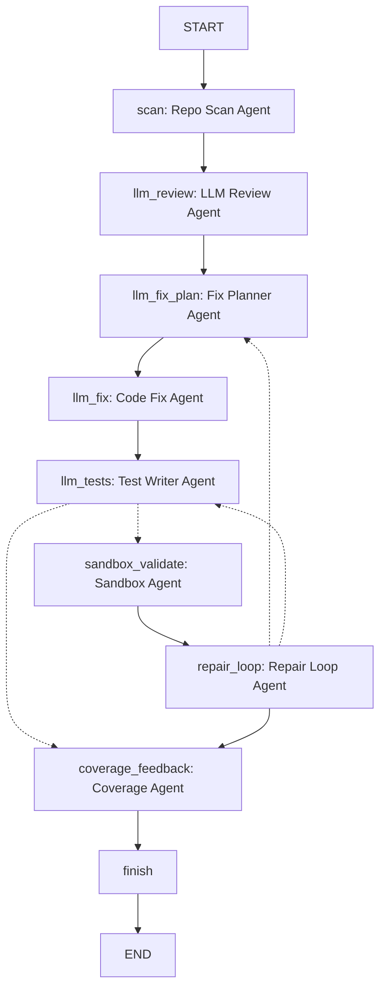
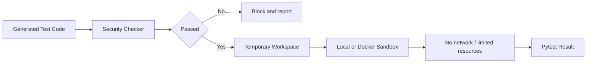

# Software Engineer Agent Architecture

## 1. 项目定位

Software Engineer Agent 是一个面向 Python 项目的软件工程师 Agent 与权限隔离执行平台。系统将软件工程师常见工作拆成多个可观察 Agent 节点：仓库扫描、LLM 代码审查、修复目标规划、LLM 修复建议、LLM 单测生成、沙箱验证、失败回跳和覆盖反馈。

当前版本只保留两个 CLI：

- `src.engineer`：主入口，运行完整 LangGraph 软件工程师 Agent。
- `src.benchmark`：评估入口，基于当前 LangGraph 工作流运行 benchmark。

旧的辅助 Pipeline、独立 review/unit-test/llm-test CLI、`docs/specs/` 独立规格文件和辅助文档已经移除。Product Spec / Architecture Spec / API Spec 已集中写入 `docs/CS599_大作业报告.md` 第二章。

## 2. 当前文件结构

```text
cs599-project/
├── README.md
├── Dockerfile.sandbox
├── requirements.txt
├── 课程要求.md
├── docs/
│   ├── architecture.md
│   ├── CS599_大作业报告.md
│   ├── CS599_大作业报告.pdf
│   └── runs/
│       ├── software_engineer.json
│       ├── software_engineer.md
│       ├── software_engineer_agent_flow.png
│       └── benchmark.json
├── scripts/
│   ├── export_report_pdf.py
│   ├── final_verify.ps1
│   └── run_demo.ps1
├── src/
│   ├── agents/
│   ├── evaluation/
│   ├── llm/
│   ├── sandbox/
│   ├── tools/
│   └── workflow/
├── web/
│   └── agent-viewer/
└── tests/
```

## 3. 总体架构



`docs/runs/software_engineer_agent_flow.png` 是当前 LangGraph 状态图导出的 PNG，其他文档中的流程说明应以该图为准。

## 4. Agent 编排

主入口：

```bash
python -m src.engineer <project_path>
```

核心流程：

```text
scan
  -> llm_review
  -> llm_fix_plan
  -> llm_fix
  -> llm_tests
  -> sandbox_validate? / coverage_feedback
  -> repair_loop?
      -> llm_fix_plan
      -> llm_tests
      -> coverage_feedback
  -> finish
```

关键路由：

- `scan` 总是产出结构化 `RepositoryScanResult`，即使扫描失败也返回 `status=failed` 和 `error_summary`。
- `llm_review` 使用真实 LLM 生成 findings；缺少 API key、扫描失败或请求失败时返回结构化状态。
- `llm_fix_plan` 从 findings 中选择本轮修复目标，优先 LLM 决策，失败时降级为确定性排序。
- `llm_fix` 根据选中的 findings 和沙箱反馈生成修复建议；显式传入 `--apply-fixes` 时才写回源码。
- `llm_tests` 使用真实 LLM 生成 pytest；缺少 API key、扫描失败或请求失败时返回结构化状态。
- `sandbox_validate` 在临时工作区中运行测试；Docker/local 执行异常会转换成结构化失败报告。
- `repair_loop` 根据沙箱结果决定回到 `llm_fix_plan`、回到 `llm_tests`，或进入 `coverage_feedback`。

## 5. 分层设计

### 5.1 CLI 层

- `src.engineer`：运行完整 Software Engineer Agent LangGraph 工作流。
- `src.benchmark`：运行 benchmark，并输出 `docs/runs/benchmark.json`。

### 5.2 Workflow 层

核心文件：`src/workflow/software_engineer_graph.py`

职责：

- 构建 LangGraph `StateGraph`。
- 定义节点执行顺序和条件路由。
- 维护 `SoftwareEngineerGraphState`。
- 输出 Agent Timeline、Highlights 和最终状态。

### 5.3 Agent 层

| Agent | 文件 | 职责 |
| --- | --- | --- |
| Repo Scan Agent | `src/agents/repo_scanner.py` | 扫描源码、测试、配置、依赖、包根、入口点和 issues。 |
| LLM Review Agent | `src/agents/llm_code_reviewer.py` | 调用真实 LLM 做语义代码审查。 |
| Fix Planner Agent | `src/agents/llm_fix_planner.py` | 选择本轮修复目标并排序。 |
| Code Fix Agent | `src/agents/llm_code_fixer.py` | 生成修复建议，并在写回前做 patch safety review。 |
| Test Writer Agent | `src/agents/llm_test_generator.py` | 生成 pytest 测试。 |
| Sandbox Agent | `src/agents/sandbox_validator.py` | 在 local 或 Docker 后端运行生成测试。 |
| Repair Loop Agent | `src/agents/repair_loop.py` | 根据沙箱结果决定下一步。 |
| Coverage Agent | `src/agents/coverage_feedback.py` | 汇总函数覆盖情况。 |

### 5.4 Tool / LLM 层

- `src/tools/software_engineer_graph_writer.py`：写出 JSON 和 Markdown 运行报告。
- `src/tools/agent_event_log.py`：写出前端可读取的 Agent 事件 JSONL。
- `src/tools/test_workspace.py`：创建临时测试工作区。
- `src/llm/prompt_builder.py`：构建 LLM Prompt。
- `src/llm/config.py`：读取 provider、模型、API Key、超时和重试配置。
- `src/llm/client.py`：OpenAI-compatible LLM 调用，支持 token 级 stream。

### 5.5 Sandbox 层



隔离策略：

1. 生成测试先经过 Security Checker。
2. 默认 dry-run，不写回目标项目。
3. 只有显式传入 `--apply-fixes` 或 `--apply-tests` 才会写回。
4. 沙箱验证在临时工作区运行，降低对原项目的影响。
5. Docker executor 使用网络、资源、capabilities 和只读容器约束。

## 6. 状态对象与结构化输出

`SoftwareEngineerGraphState` 中的核心字段：

| 字段 | 说明 |
| --- | --- |
| `scan` | Repo Scan Agent 结构化扫描结果。 |
| `llm_review` | LLM 审查 findings。 |
| `llm_fix_plan` | 本轮修复目标。 |
| `llm_fix` | LLM 修复建议。 |
| `llm_tests` | LLM 生成测试。 |
| `sandbox_validation` | 沙箱 pytest 结果和失败诊断。 |
| `repair_loop` | 下一步修复决策。 |
| `coverage_feedback` | 函数覆盖反馈。 |
| `node_trace` | 已执行节点轨迹。 |

Repo Scan Agent 的 stream 输出为紧凑 JSON 摘要，例如：

```json
{"status":"scanned","source_files":1,"test_files":0,"config_files":0,"dependency_files":0,"package_roots":0,"entry_points":0,"issues":[],"error_summary":""}
```

## 7. 报告与文档

当前保留的核心文档：

- `README.md`：项目入口、运行方式和交付物说明。
- `docs/architecture.md`：当前架构说明。
- `docs/CS599_大作业报告.md`：课程最终报告源文件，包含封面、目录、七章正文和内嵌 SDD Specs。
- `docs/CS599_大作业报告.pdf`：由 `scripts/export_report_pdf.py` 导出的最终 PDF，包含书签导航。
- `docs/runs/software_engineer.json`：主 Agent JSON 运行报告。
- `docs/runs/software_engineer.md`：主 Agent Markdown 运行报告。
- `docs/runs/software_engineer_events.jsonl`：节点级事件日志，供前端 Viewer 回放 Timeline。
- `docs/runs/software_engineer_agent_flow.png`：LangGraph 流程图。
- `docs/runs/benchmark.json`：Benchmark 输出。
- `web/agent-viewer/`：静态前端可视化界面，展示 Agent 状态图、Timeline 和每轮中间输出。

## 8. 可观测性

运行时输出：

- `[agent-stream]`：节点级进度和 Repo Scan 结构化摘要。
- `[llm-stream]`：默认开启的 LLM token 级输出。
- `software_engineer_events.jsonl`：结构化 `node_start` / `node_end` 事件。
- `Agent Timeline`：每个 Agent 的执行结果。
- `Highlights`：关键发现、修复计划、沙箱结果和覆盖反馈。

报告记录：

- `node_trace`
- `graph_runtime`
- 每个 Agent 的结构化状态
- attempted / resolved / unresolved findings
- 沙箱执行结果与失败诊断
- 覆盖反馈

前端 Viewer 读取 `docs/runs/software_engineer.json` 和 `docs/runs/software_engineer_events.jsonl`，将一次运行拆成：

- Agent 状态图：标记已执行节点和当前最后节点。
- Timeline：按事件顺序展示节点开始和完成状态。
- 每轮中间输出：汇总 fix plan、code fix、test writer、sandbox 和 repair loop 的历史记录。

## 9. 课程要求映射

| 课程要求 | 架构对应 |
| --- | --- |
| SDD 规格驱动开发 | `docs/CS599_大作业报告.md` 第二章内嵌 Product Spec / Architecture Spec / API Spec |
| 工具调用 | Repo Scan Agent、Security Checker、Sandbox Executor、Report Writer、LLM Client |
| 状态管理与多步推理 | LangGraph `StateGraph` |
| 多智能体协作 | Scan、Review、Fix Plan、Fix、Test、Sandbox、Repair、Coverage |
| 可观测性与评估 | JSON / Markdown 运行报告、Agent Timeline、Benchmark |
| 权限隔离 | Docker sandbox、临时工作区、Security Checker、环境变量密钥管理 |
