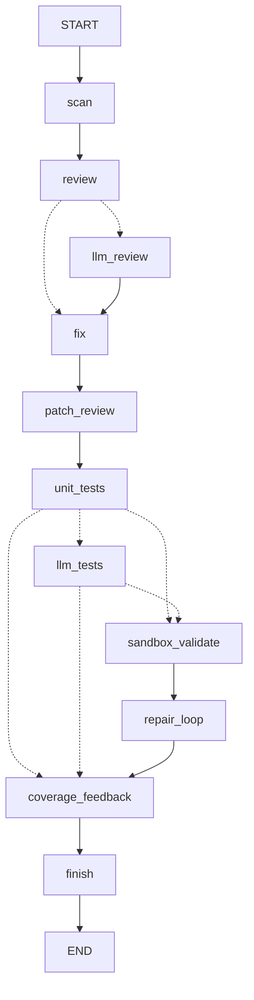
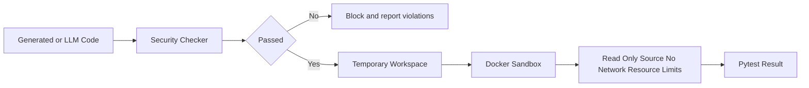
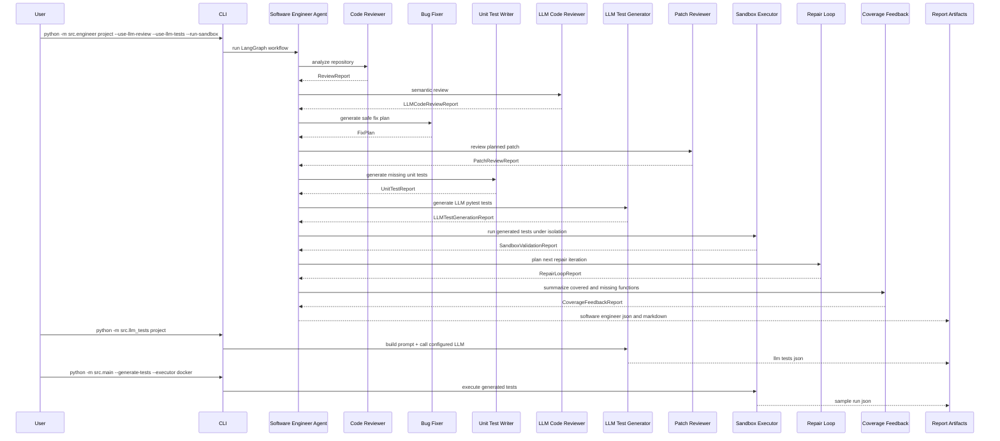

# Software Engineer Agent Architecture

## 1. 新项目定位

Software Engineer Agent 当前定位为 **面向 Python 项目的软件工程师 Agent 与权限隔离执行平台**。

系统不再只是“自动生成测试并执行”的单一工具，而是围绕软件工程师日常工作流进行 Agent 化编排：

- 代码审查：发现危险调用、疑似硬编码密钥、宽泛异常、测试缺失和边界风险。
- 自动修 Bug：默认 dry-run 生成修复计划，用户确认后才写回。
- 生成单测：为缺失覆盖的公开函数生成 pytest。
- LLM 测试生成：接入 DashScope / DeepSeek / OpenAI-compatible 模型，默认使用真实 LLM Agent 调用。
- 权限隔离执行：通过 Docker 沙箱、临时工作区、只读挂载、禁用网络和资源限制降低执行风险。

该设计对应课程方向一“Agentic AI 原生开发”，覆盖 SDD、工具调用、状态管理、多步骤推理、可观测性与评估、Docker 沙箱等课程要求。

## 2. 总体架构



该图以 `docs/runs/software_engineer_agent_flow.png` 中由 LangGraph 导出的真实状态图为准。`unit_tests` 内部会调用 Test Planner、规则 Test Generator 和 Security Checker；`llm_tests` 内部会调用 Prompt Builder、LLM Client 和 Security Checker；`sandbox_validate` 内部会调用临时工作区和沙箱执行器。

## 3. 分层设计

### 3.1 CLI 入口层

面向课程 Demo 和评审者，提供可重复运行的命令：

- `src.engineer`：当前主入口，运行完整 LangGraph 软件工程师 Agent。
- `src.main`：辅助的传统测试生成、沙箱执行、结果分析闭环。
- `src.review`：代码审查。
- `src.fix`：自动修 Bug 计划。
- `src.unit_tests`：缺失覆盖单测生成。
- `src.llm_tests`：LLM 测试生成。
- `src.benchmark`：评估与指标汇总。

### 3.2 Agent 编排层

核心是基于 LangGraph `StateGraph` 的 `Software Engineer Agent`：

```text
START
  -> scan
  -> review
  -> llm_review / fix
  -> fix
  -> patch_review
  -> unit_tests
  -> llm_tests / sandbox_validate / coverage_feedback
  -> sandbox_validate / coverage_feedback
  -> repair_loop
  -> coverage_feedback
  -> finish
  -> END
```

真实状态图以 `docs/runs/software_engineer_agent_flow.png` 的 LangGraph 导出结果为准。关键条件分支如下：

- `review` 后：启用 `--use-llm-review` 时进入 `llm_review`，否则直接进入 `fix`。
- `unit_tests` 后：启用 `--use-llm-tests` 时进入 `llm_tests`；未启用时根据 `--run-sandbox` 进入 `sandbox_validate` 或 `coverage_feedback`。
- `llm_tests` 后：启用 `--run-sandbox` 时进入 `sandbox_validate`，否则进入 `coverage_feedback`。
- `sandbox_validate` 后固定进入 `repair_loop`，再进入 `coverage_feedback`。

项目推荐的完整演示流会同时启用 `--use-llm-review`、`--use-llm-tests` 和 `--run-sandbox`，因此实际运行路径为 `scan -> review -> llm_review -> fix -> patch_review -> unit_tests -> llm_tests -> sandbox_validate -> repair_loop -> coverage_feedback -> finish`。CLI 保留这些开关，便于在无模型额度或无 Docker 的环境中运行精简流。

该层体现 Agentic AI 的多步骤推理与状态管理。每个节点都消费并返回结构化状态，最终合并为统一 JSON / Markdown 报告，并记录 `node_trace`、`status` 和 `graph_runtime`。

### 3.3 工具调用层

系统中的工具均保持小而明确的边界：

- `repo_scanner`：扫描 Python 项目。
- `test_workspace`：创建临时测试工作区。
- `report_writer` / `review_writer` / `fix_writer` / `unit_test_writer` / `llm_test_writer` / `software_engineer_graph_writer`：输出结构化工件和可读 Markdown 报告。
- `prompt_builder`：将 TestPlan 和源码上下文转为 LLM Prompt。
- `llm.client`：通过 OpenAI-compatible 接口调用 DashScope、DeepSeek 等模型。

这些模块可视为 Function Calling / Tool Use 的本地实现。

### 3.4 权限隔离层

权限隔离由三道闸组成：

1. 生成代码执行前必须经过 Security Checker。
2. 默认 dry-run，不直接写回用户项目；写回必须显式传入 `--apply` / `--apply-fixes` / `--apply-tests`。
3. 测试执行可进入 Docker 沙箱，限制网络、文件系统和资源。



### 3.5 可观测与评估层

所有关键 Agent 都输出 JSON 工件：

- `sample_run.json`
- `benchmark.json`
- `llm_prompt.json`
- `llm_tests.json`
- `review.json`
- `fix_plan.json`
- `unit_tests.json`
- `software_engineer.json`
- `software_engineer.md`

这些工件支持课程报告中的测试评估、Demo 兜底和可复现审计。

## 4. 数据流



## 5. 课程要求映射

| 课程要求 | 架构对应 |
| --- | --- |
| SDD 规格驱动开发 | `docs/specs/product_spec.md`、`architecture_spec.md`、`api_spec.md` |
| 工具使用 / Function Calling | Repo Scanner、Security Checker、Docker Executor、LLM Client、Report Writers |
| 状态管理与多步骤推理 | LangGraph StateGraph 串联 scan/review/llm_review/fix/patch_review/unit_tests/llm_tests/sandbox_validate/repair_loop/coverage_feedback/finish 节点 |
| 多智能体协作 | Code Reviewer、LLM Code Reviewer、Bug Fixer、Patch Reviewer、Unit Test Writer、LLM Test Generator、Sandbox Validator、Repair Loop、Coverage Feedback 分工协作 |
| 可观测性与评估 | JSON artifacts、Benchmark、单元测试、Demo Guide |
| 权限隔离 | Docker 沙箱、Security Checker、dry-run apply gate、环境变量密钥管理 |

## 6. 阶段验收命令

```bash
python -m unittest discover -s tests
python -m compileall src tests examples
python -m src.engineer examples/review_target --use-llm-review --use-llm-tests --run-sandbox --sandbox-executor docker --docker-image software-engineer-agent-python:latest --output docs/runs/software_engineer.json
python -m src.llm_tests examples/sample_python_project --output docs/runs/llm_tests.json
```

如需展示完整权限隔离闭环：

```bash
docker build -f Dockerfile.sandbox -t software-engineer-agent-python .
python -m src.engineer examples/review_target --use-llm-review --use-llm-tests --run-sandbox --sandbox-executor docker --docker-image software-engineer-agent-python:latest --output docs/runs/software_engineer.json --output-md docs/runs/software_engineer.md
```
