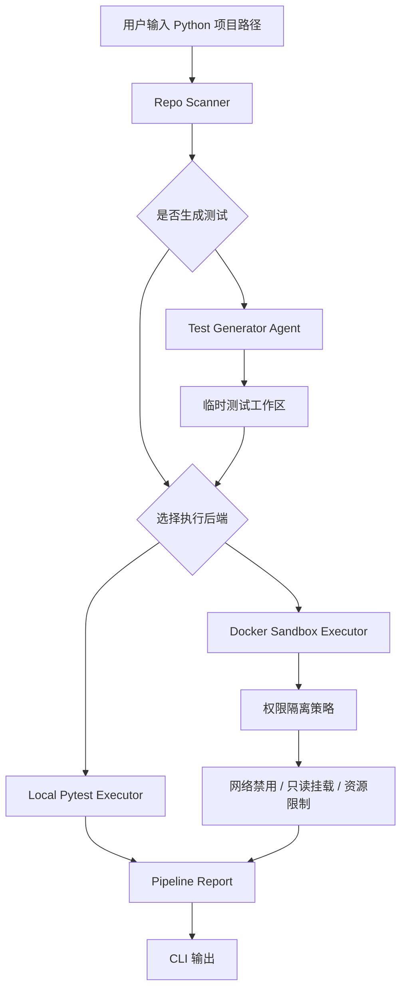
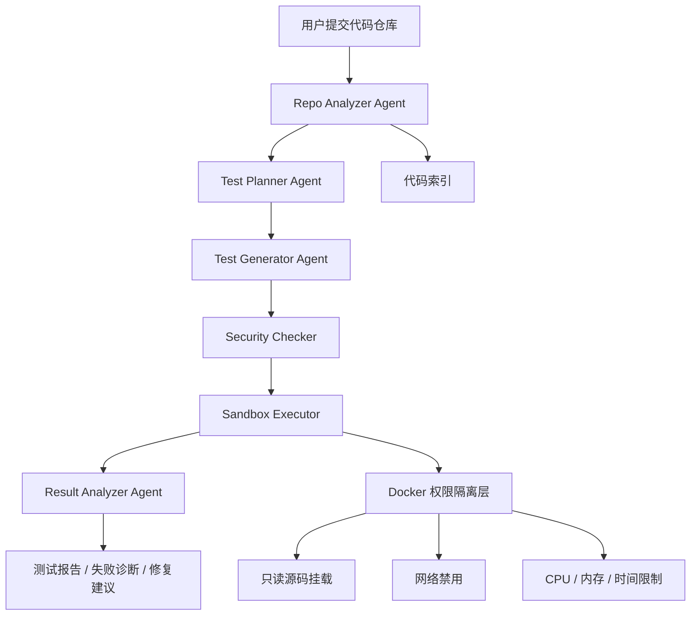

# TestGuard Agent Architecture

## 当前阶段架构



## 目标阶段架构



## 第一阶段验收标准

运行以下命令：

```bash
python -m src.main examples/sample_python_project
```

系统能够完成项目扫描、pytest 执行和命令行报告输出。

## 第二阶段验收标准

运行以下命令：

```bash
docker build -f Dockerfile.sandbox -t testguard-python .
python -m src.main examples/sample_python_project --executor docker
```

系统能够在 Docker 沙箱中完成项目扫描、pytest 执行和命令行报告输出。

## 第三阶段验收标准

运行以下命令：

```bash
python -m src.main examples/sample_python_project --generate-tests --executor docker
```

系统能够自动生成 pytest 测试，在临时工作区中执行，并在报告中展示生成测试数量。
