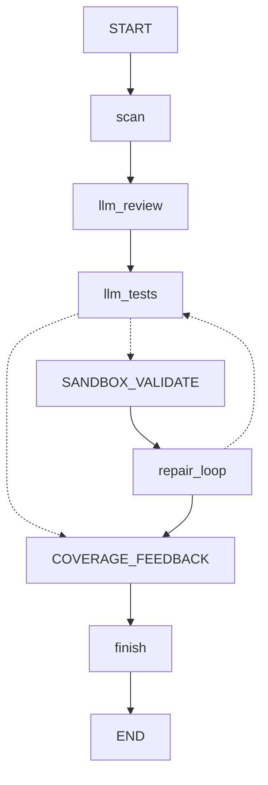
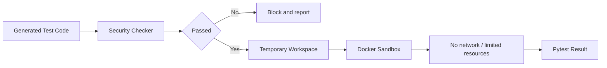

# Software Engineer Agent Architecture

## 1. 项目定位

Software Engineer Agent 是一个面向 Python 项目的软件工程师 Agent 与权限隔离执行平台。它将软件工程师的常见工作拆成多个可观测 Agent：代码扫描、LLM 语义审查、LLM 测试生成、沙箱验证、失败后回跳重试的修复循环和覆盖反馈。

当前版本不再包含基于人工规则的 Bug Fix Agent、Patch Review Agent、规则 Review 节点和模板 Unit Test 节点。主流程默认直接使用 LLM Agent。

## 2. 总体架构



`docs/runs/software_engineer_agent_flow.png` 是由当前 LangGraph 状态图导出的 PNG，其他文档中的流程图应以该图为准。

## 3. Agent 编排

主入口是 `python -m src.engineer`，由 `src/workflow/software_engineer_graph.py` 构建 LangGraph `StateGraph`。

```text
scan
  -> llm_review
  -> llm_tests
  -> sandbox_validate 可选
  -> repair_loop
      -> llm_tests 可选重试
      -> coverage_feedback
  -> coverage_feedback
  -> finish
```

条件分支：

- `llm_review` 后：固定进入 `llm_tests`。
- `llm_tests` 后：启用 `--run-sandbox` 时进入 `sandbox_validate`，否则进入 `coverage_feedback`。
- `sandbox_validate` 后：进入 `repair_loop`。如果测试失败且未达到 `--repair-iterations` 上限，则回到 `llm_tests` 重新生成并再次验证；如果测试通过或达到上限，则进入 `coverage_feedback`。

## 4. 分层设计

### 4.1 CLI 层

- `src.engineer`：主入口，运行完整 LangGraph 软件工程师 Agent。
- `src.llm_tests`：独立 LLM 测试生成入口。
- `src.main`：辅助测试生成与沙箱执行 Pipeline。
- `src.benchmark`：评估入口。

### 4.2 Agent 层

- `llm_code_reviewer`：调用真实 LLM 做语义审查。
- `llm_test_generator`：调用真实 LLM 生成 pytest。
- `sandbox_validator`：在 local 或 Docker 后端运行生成测试。
- `repair_loop`：根据沙箱结果决定是否回跳 `llm_tests` 重试，或结束循环进入覆盖反馈。
- `coverage_feedback`：汇总函数覆盖情况。

### 4.3 工具层

- `repo_scanner`：扫描 Python 源码结构。
- `test_workspace`：创建临时测试工作区。
- `software_engineer_graph_writer`：写出 JSON 和 Markdown 报告。
- `prompt_builder`：构建 LLM Prompt。
- `llm.client`：OpenAI-compatible LLM 调用。

### 4.4 权限隔离层



隔离策略：

1. 生成的测试代码先经过 Security Checker。
2. 默认 dry-run，不写回目标项目；写回测试必须显式传入 `--apply-tests`。
3. 测试执行可进入 Docker 沙箱，限制网络、文件系统和资源。

## 5. 可观测性

主 Agent 输出：

- `docs/runs/software_engineer.json`
- `docs/runs/software_engineer.md`
- `node_trace`
- `graph_runtime`
- 各 Agent 的结构化报告

## 6. 课程要求映射

| 课程要求 | 架构对应 |
| --- | --- |
| SDD 规格驱动开发 | `docs/specs/` |
| 工具调用 | Scanner、Security Checker、Sandbox Executor、Report Writer、LLM Client |
| 状态管理与多步骤推理 | LangGraph StateGraph |
| 多智能体协作 | LLM Review、LLM Test、Sandbox、Repair、Coverage |
| 可观测性与评估 | JSON / Markdown artifacts、Benchmark |
| 权限隔离 | Docker sandbox、临时工作区、Security Checker、环境变量密钥管理 |
