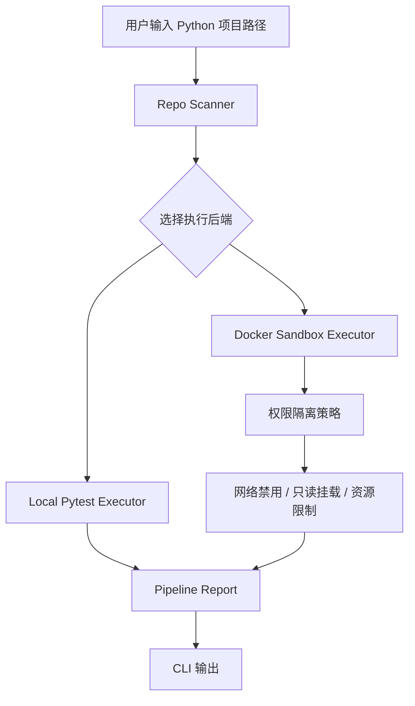
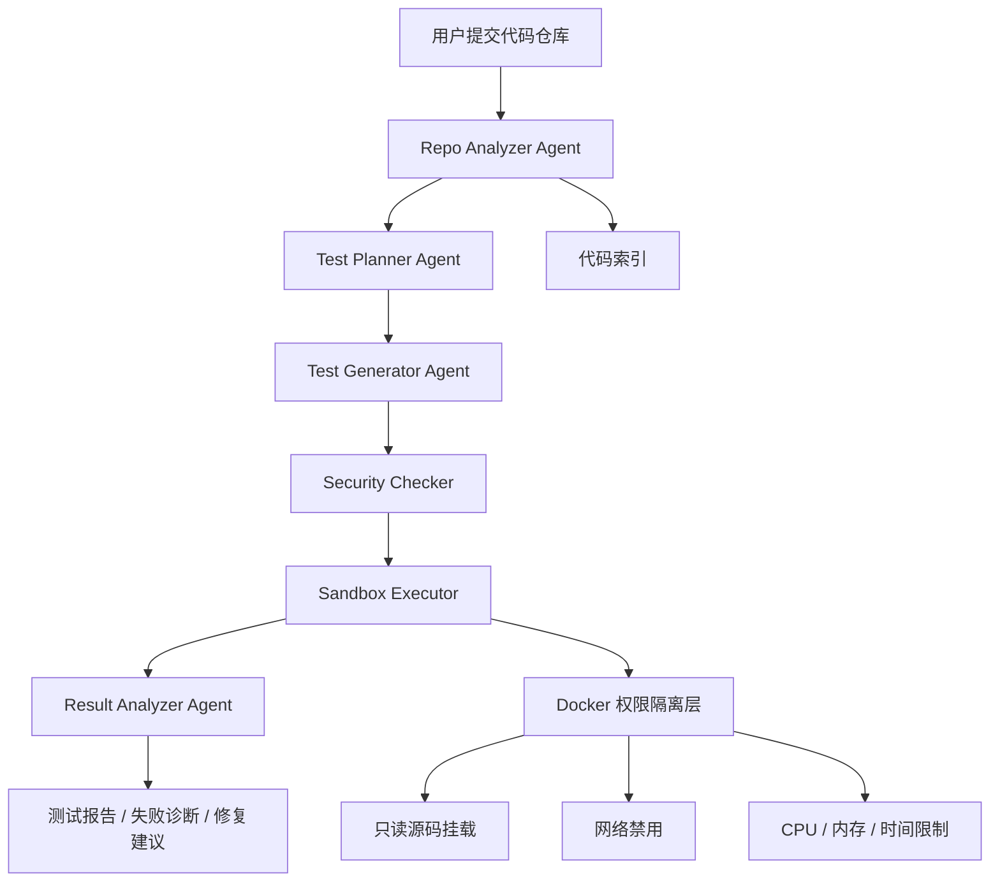

# TestGuard Agent Architecture

## 当前阶段架构


```mermaid
flowchart TD
    A["用户输入 Python 项目路径"] --> B["Repo Scanner"]
    B --> C{"选择执行后端"}
    C --> D["Local Pytest Executor"]
    C --> E["Docker Sandbox Executor"]
    E --> F["权限隔离策略"]
    F --> G["网络禁用 / 只读挂载 / 资源限制"]
    D --> H["Pipeline Report"]
    G --> H
    H --> I["CLI 输出"]
```

## 目标阶段架构


```mermaid
flowchart TD
    A["用户提交代码仓库"] --> B["Repo Analyzer Agent"]
    B --> C["Test Planner Agent"]
    C --> D["Test Generator Agent"]
    D --> E["Security Checker"]
    E --> F["Sandbox Executor"]
    F --> G["Result Analyzer Agent"]
    G --> H["测试报告 / 失败诊断 / 修复建议"]

    B --> I["代码索引"]
    F --> J["Docker 权限隔离层"]
    J --> K["只读源码挂载"]
    J --> L["网络禁用"]
    J --> M["CPU / 内存 / 时间限制"]
```

## 第一阶段验收标准

运行以下命令：

```bash
python -m src.main examples/sample_python_project
```

系统能够完成项目扫描、pytest 执行和命令行报告输出。
