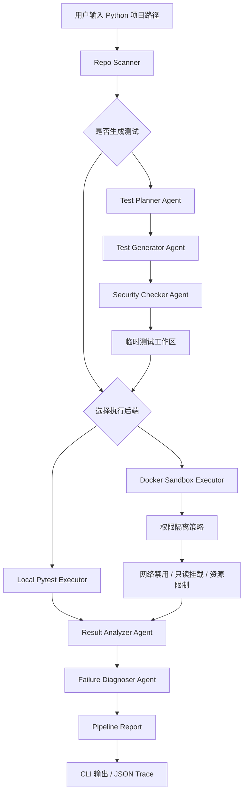
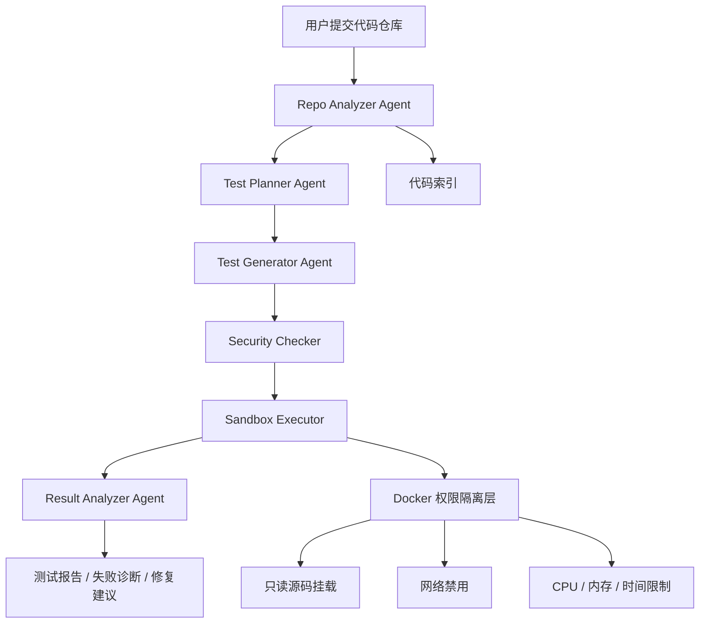

# TestGuard Agent Architecture

## 当前阶段架构



## 目标阶段架构



## 第一阶段验收标准

运行以下命令：

```bash
python -m src.main examples/sample_python_project
```

系统能够完成项目扫描、pytest 执行和命令行报告输出。

## 第二阶段验收标准

运行以下命令：

```bash
docker build -f Dockerfile.sandbox -t testguard-python .
python -m src.main examples/sample_python_project --executor docker
```

系统能够在 Docker 沙箱中完成项目扫描、pytest 执行和命令行报告输出。

## 第三阶段验收标准

运行以下命令：

```bash
python -m src.main examples/sample_python_project --generate-tests --executor docker
```

系统能够生成结构化测试计划和 pytest 测试，在临时工作区中执行，并在报告中展示规划与生成测试数量。

## 第四阶段验收标准

运行以下命令：

```bash
python -m src.main examples/sample_python_project --generate-tests --executor docker --report-json docs/runs/sample_run.json
```

系统能够解析 pytest 汇总结果，并输出包含扫描、执行、分析和生成测试信息的 JSON 报告。

## 第五阶段验收标准

运行以下命令：

```bash
python -m src.benchmark --executor docker --output docs/runs/benchmark.json
```

系统能够批量运行评估用例，并输出包含通过率、pytest 用例数量、规划测试数量、生成测试数量和总耗时的 Benchmark JSON 报告。

## 第六阶段验收标准

当 pytest 失败或超时时，系统能够在 CLI 和 JSON 报告中输出失败类型、关键线索和修复建议。

## 第七阶段验收标准

生成的 pytest 测试在执行前经过 Security Checker Agent，CLI 和 JSON 报告中能够展示安全检查是否通过。
