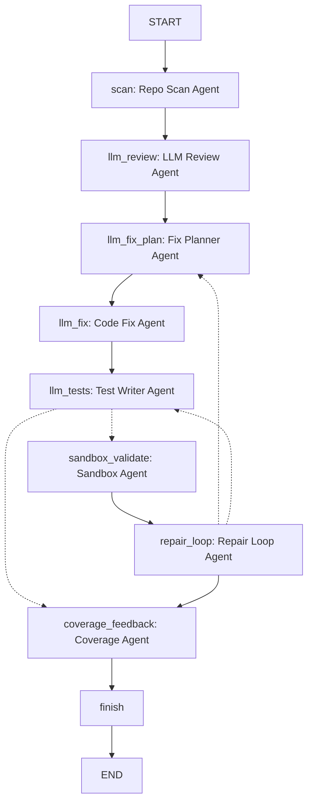
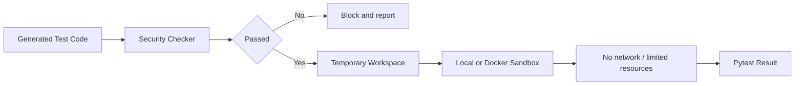

# Software Engineer Agent Architecture

## 1. 项目定位

Software Engineer Agent 是一个面向 Python 项目的软件工程师 Agent 与权限隔离执行平台。它将软件工程师的常见工作拆成多个可观察节点：真实项目扫描、LLM 代码审查、修复目标规划、LLM 代码修复、LLM 单测生成、沙箱验证、失败回跳修复和覆盖反馈。

当前版本只保留 `src.engineer` 作为主入口。旧的辅助 Pipeline 和独立 review/unit-test/llm-test CLI 已经移除。

## 2. 总体架构



`docs/runs/software_engineer_agent_flow.png` 是由当前 LangGraph 状态图导出的 PNG；其他文档中的流程说明应以该图为准。

## 3. Agent 编排

主入口：

```bash
python -m src.engineer <project_path>
```

核心流程：

```text
scan
  -> llm_review
  -> llm_fix_plan
  -> llm_fix
  -> llm_tests
  -> sandbox_validate? / coverage_feedback
  -> repair_loop?
      -> llm_fix_plan
      -> llm_tests
      -> coverage_feedback
  -> finish
```

关键路由：
- `scan` 总是产出结构化 `RepositoryScanResult`，即使扫描失败也返回 `status=failed` 和 `error_summary`。
- `llm_review` 使用真实 LLM 生成 findings；缺少 API key、扫描失败或请求失败时返回结构化状态，不中断 graph。
- `llm_fix_plan` 从 findings 中选择本轮修复目标，优先 LLM 决策，失败时降级为确定性排序。
- `llm_fix` 根据选中的 findings 和沙箱反馈生成最小修复建议；显式传入 `--apply-fixes` 时才写回源码。
- `llm_tests` 使用真实 LLM 生成 pytest；缺少 API key、扫描失败或请求失败时返回结构化状态。
- `sandbox_validate` 在临时工作区中运行测试；Docker/local 执行异常会转换成结构化失败报告。
- `repair_loop` 根据沙箱结果决定回到 `llm_fix_plan`、回到 `llm_tests`，或进入 `coverage_feedback`。

CLI 默认输出 `[agent-stream]` 节点进度，并默认开启 `[llm-stream]` token 级模型输出。安静模式可传入：

```bash
--no-stream --no-llm-token-stream
```

## 4. 分层设计

### 4.1 CLI 层

- `src.engineer`：唯一主入口，运行完整 Software Engineer Agent LangGraph 工作流。
- `src.benchmark`：基于当前 LangGraph 工作流运行基准样例。

### 4.2 Agent 层

- `repo_scanner`：扫描真实 Python 项目结构、配置文件、依赖文件、包根、入口点和扫描问题。
- `llm_code_reviewer`：调用真实 LLM 做语义代码审查。
- `llm_fix_planner`：选择本轮修复目标并排序。
- `llm_code_fixer`：调用真实 LLM 生成修复建议，并在写回前做 patch safety review。
- `llm_test_generator`：调用真实 LLM 生成 pytest。
- `sandbox_validator`：在 local 或 Docker 后端运行生成测试。
- `repair_loop`：根据沙箱结果决定下一步。
- `coverage_feedback`：汇总函数覆盖情况。

### 4.3 工具层

- `software_engineer_graph_writer`：写出 JSON 和 Markdown 报告。
- `test_workspace`：创建临时测试工作区。
- `prompt_builder`：构建 LLM Prompt。
- `llm.client`：OpenAI-compatible LLM 调用。

### 4.4 权限隔离层



隔离策略：
1. 生成的测试代码先经过 Security Checker。
2. 默认 dry-run，不写回目标项目。
3. 只有显式传入 `--apply-fixes` 或 `--apply-tests` 才会写回。
4. 沙箱验证在临时工作区中运行，降低对原项目的影响。

## 5. 可观测性

主要产物：
- `docs/runs/software_engineer.json`
- `docs/runs/software_engineer.md`
- `docs/runs/software_engineer_agent_flow.png`

报告记录：
- `node_trace`
- `graph_runtime`
- 每个 Agent 的结构化状态
- attempted / resolved / unresolved findings
- 沙箱执行结果与失败诊断
- 覆盖反馈

## 6. 课程要求映射

| 课程要求 | 架构对应 |
| --- | --- |
| SDD 规格驱动开发 | `docs/specs/` |
| 工具调用 | Repo Scan Agent、Security Checker、Sandbox Executor、Report Writer、LLM Client |
| 状态管理与多步推理 | LangGraph StateGraph |
| 多智能体协作 | Scan、Review、Fix Plan、Fix、Test、Sandbox、Repair、Coverage |
| 可观测性与评估 | JSON / Markdown artifacts、Benchmark |
| 权限隔离 | Docker sandbox、临时工作区、Security Checker、环境变量密钥管理 |
